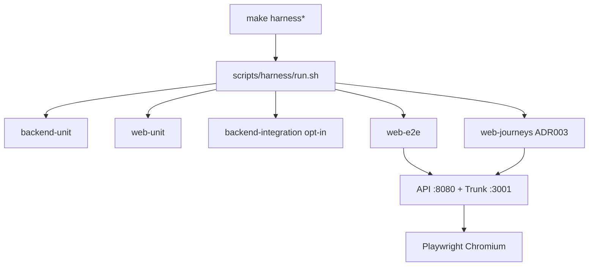

# PPI — Integral Test Harness

Harness unificado para validar **backend Go** + **frontend Leptos (unit + E2E Playwright)** desde la raíz del monorepo, con reportes por módulo y teardown del stack.

> Decisión de arquitectura: **[ADR 003 — Sistema de pruebas](docs/adr/0003-sistema-de-pruebas.md)**  
> Diagramas Mermaid de páginas: **[docs/testing/journeys.md](docs/testing/journeys.md)**

## Vista rápida

```bash
# Suite completa (unit + integration opcional + e2e con stack efímero)
make harness

# Solo capas rápidas (sin levantar UI)
make harness-unit

# Integración Go (opt-in)
PPI_HARNESS_INTEGRATION=1 make harness-integration

# Solo E2E (levanta API+Trunk, corre Playwright, apaga procesos)
make harness-e2e

# Journeys Auth+Hub P1→P3 (ADR 003)
make harness-journeys

# Unlock local human account (dev only)
make dev-set-password EMAIL=vos@example.com PASSWORD=secreto12
```

Reportes: `artifacts/harness/<timestamp>/` (`summary.tsv`, logs por módulo, report Playwright si falló).

## Arquitectura



| Módulo | Qué valida | Dónde vive |
|---|---|---|
| `backend-unit` | Use cases, handlers httptest, repos | `backend/**/*_test.go` |
| `web-unit` | Contratos API / URLs Wasm | `web/` (`cargo test`) |
| `backend-integration` | Endpoints críticos contra mux real + SQLite archivo | `backend/internal/integration/` (`//go:build integration`) |
| `web-e2e` | Pack completo Playwright | `web/e2e/tests/` |
| `web-journeys` | Páginas 1→3 auth + hub oiladas | `journey.auth-hub` + validation + session.navigation |

## Ampliación de la batería (roadmap de suites)

### Playwright (`web/e2e/tests/`)

| Spec | Estado | Intención |
|---|---|---|
| `journey.auth-hub.spec.ts` | **Activo** | Transversal P1→P3 + recovery + hub loop |
| `auth.login.spec.ts` | **Activo** | Landing CTAs + login → `/workspace` |
| `auth.reset.spec.ts` | **Activo** | Forgot → resetToken DX → workspace |
| `auth.validation.spec.ts` | **Activo** | 401 login + password corta en register |
| `session.navigation.spec.ts` | **Activo** | Portada autenticada ↔ workspace + orphan JWT |
| `workspace.navigation.spec.ts` | Esqueleto | Ampliar chrome logout legacy |
| `levels.browse.spec.ts` | Esqueleto (futuro cutover) | Listar/navegar niveles en Leptos |

Convención: specs nuevos van bajo `web/e2e/tests/<dominio>.*.spec.ts`. Marcar pendientes con `test.describe.skip` hasta que el UI exista; no borrar Qwik en E2E de cutover.

### Go integration (`backend/internal/integration/`)

| Test | Estado | Intención |
|---|---|---|
| `auth_api_test.go` | Esqueleto | Register/login/me/logout sobre `ServeMux` + SQLite temp file |
| `levels_api_test.go` | Esqueleto | `GET /api/levels/current` + `GET /api/levels/{id}` |
| `health_api_test.go` | Esqueleto | `GET /api/health` + headers CORS mínimos |

Activar con:

```bash
PPI_HARNESS_INTEGRATION=1 make harness-integration
```

## Orquestación y códigos de salida

- Cada módulo escribe `PASS` | `FAIL` | `SKIP` en `summary.tsv`.
- El harness termina **≠ 0** si algún módulo es `FAIL`.
- `SKIP` (integración off / e2e off con `PPI_HARNESS_SKIP_E2E=1`) no falla el run.
- Logs de API/Trunk viven junto al summary para diagnóstico rápido.

## Variables útiles

| Variable | Default | Uso |
|---|---|---|
| `PPI_HARNESS_INTEGRATION` | `0` | `1` ejecuta tests `-tags=integration` |
| `PPI_HARNESS_SKIP_E2E` | `0` | `1` omite Playwright en `make harness` |
| `PPI_HARNESS_REPORT_DIR` | `artifacts/harness` | Destino de reportes |
| `PPI_E2E_*` | efímero en harness | Igual que `web/e2e/README.md` |
| `JWT_SECRET` / `DATABASE_URL` | harness → `ppi-harness.db` | Stack efímero E2E |
| `PPI_EXPOSE_RESET_TOKEN` | `1` en harness | DX forgot → `resetToken` |
| `PLAYWRIGHT_BROWSERS_PATH` | cache estable del host (`/Users/<you>/Library/Caches/ms-playwright` en macOS) | El harness sobrescribe caches efímeros (`cursor-sandbox-cache`, `/var/folders`, `/tmp`) salvo `PPI_KEEP_PLAYWRIGHT_BROWSERS_PATH=1` |

## CI

- Unit backend: `.github/workflows/ci.yml`
- E2E Playwright: `.github/workflows/e2e.yml` (usuario efímero; 4 shards + agregador `Playwright Chromium smoke`)
- El target `make harness` es la **fuente de verdad local**; CI puede ir sumando jobs por módulo alineados a este mapa.
- Gate de agentes: ADR 003 — no cerrar auth/nav sin journeys verdes.

## Reglas

- No secretos en git (`.env.local` / GitHub Secrets / usuario efímero).
- No borrar `frontend/` Qwik desde pruebas.
- Código de alumnos no se ejecuta en el servidor (ADR 002).
- Ante 409/401 locales: verificar `DATABASE_URL` y `make dev-set-password` (ver Mermaid de fallos en `docs/testing/journeys.md`).
