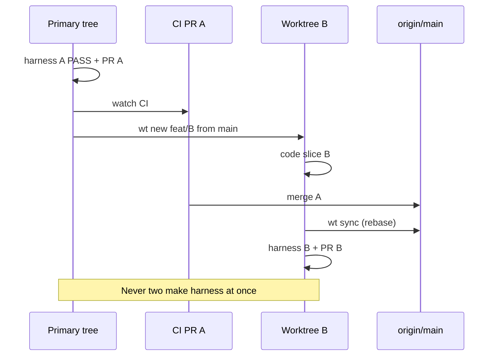

# Git worktrees — desarrollo asíncrono (PPI)

**Problema:** `make harness` + Playwright + CI de GitHub tardan ~15–20 min. Quedarse en la misma carpeta bloquea el siguiente slice.

**Solución:** un *worktree* por slice. Código en paralelo; **un solo stack local** (`:8080` / `:3001`) a la vez.

## Comando canónico

Desde el monorepo (primary o cualquier worktree):

```bash
# Rama nueva desde origin/main en carpeta hermana aislada
./scripts/worktree/wt new feat/microsteps-155-160 --bootstrap

# Equivalente Make
make wt-new BRANCH=feat/microsteps-155-160 BOOTSTRAP=1
# Path custom opcional (NO uses la variable Make PATH — chocaría con $PATH del shell):
# make wt-new BRANCH=feat/foo WT_PATH=/tmp/ppi-wt-foo BOOTSTRAP=1
```

Path por defecto:

```text
../plataforma-pensamiento-ingenieril-wt-<slug>
# ej. ../plataforma-pensamiento-ingenieril-wt-microsteps-155-160
```

Preview del path:

```bash
./scripts/worktree/wt path feat/microsteps-155-160
# o: make wt-path BRANCH=feat/microsteps-155-160
```

## Qué NO se comparte (y por qué)

| Artefacto | Estrategia |
|-----------|------------|
| `web/e2e/node_modules` | **Por worktree.** `npm ci` con `--bootstrap` (o la primera vez que corrés e2e). |
| `web/target`, `backend/bin` | **Por worktree.** Builds aislados; no symlinks (evita races de compile). |
| `data/*.db`, `artifacts/` | **Por worktree** (gitignored). Cada harness usa su SQLite. |
| Puertos `:8080` / `:3001` | **Globales al host.** Un `make harness` a la vez (lock en `/tmp/ppi-harness-ports.lock`). |
| Playwright browsers | **Compartido** (`~/Library/Caches/ms-playwright`) — el harness ya lo pinnea. |
| Go module / Cargo registry cache | **Compartido por usuario** — OK. |

Trunk proxy apunta fijo a `127.0.0.1:8080` (`web/Trunk.toml`). Por eso no corremos dos harness en paralelo: habría que regenerar proxy + ports, y el ROI es bajo frente a “codeá el siguiente PR mientras CI corre”.

## Protocolo de racha (slices de a 6)

```text
a) Rama A: implementás → make harness (PASS) → push → gh pr create → gh pr checks --watch
b) Sin esperar el verde de A: make wt-new BRANCH=feat/B BOOTSTRAP=1
   cd al worktree B (basado en origin/main) y codeás el siguiente slice
c) Cuando A mergea a main:
     make wt-sync TARGET=feat/B          # fetch + rebase origin/main (worktree limpio)
     # resolvé conflictos si aparecen; re-corré make harness en B
d) Tras merge de B + rama borrada en remote:
     make wt-rm TARGET=feat/B            # o --force si quedó sucio
```

Diagrama:



## CLI rápida

```bash
./scripts/worktree/wt list
./scripts/worktree/wt sync feat/microsteps-155-160
./scripts/worktree/wt rm  feat/microsteps-155-160
./scripts/worktree/wt rm  feat/microsteps-155-160 --force
```

Make:

```bash
make wt-list
make wt-sync TARGET=feat/microsteps-155-160
make wt-rm   TARGET=feat/microsteps-155-160
```

## Cursor / VS Code

Abrí el worktree como carpeta aparte (`File → Open Folder` en `…-wt-…`). No mezcles dos roots en el mismo agente si el contexto se confunde: un chat/agente por worktree es lo más limpio.

## Checklist post-`wt new`

1. `cd` al path impreso.
2. Implementar el slice.
3. `make harness` **solo si no hay otro harness corriendo** en el host.
4. Push + PR (TED slides).
5. Disparar el *siguiente* `wt new` mientras CI corre.

## Lead call

Worktrees matan el idle de 15 min de Playwright; el harness lock evita “dos Trunks pelean por :3001”. El cuello de botella restante es humano: merge verde → `wt sync` → re-harness del slice siguiente.
