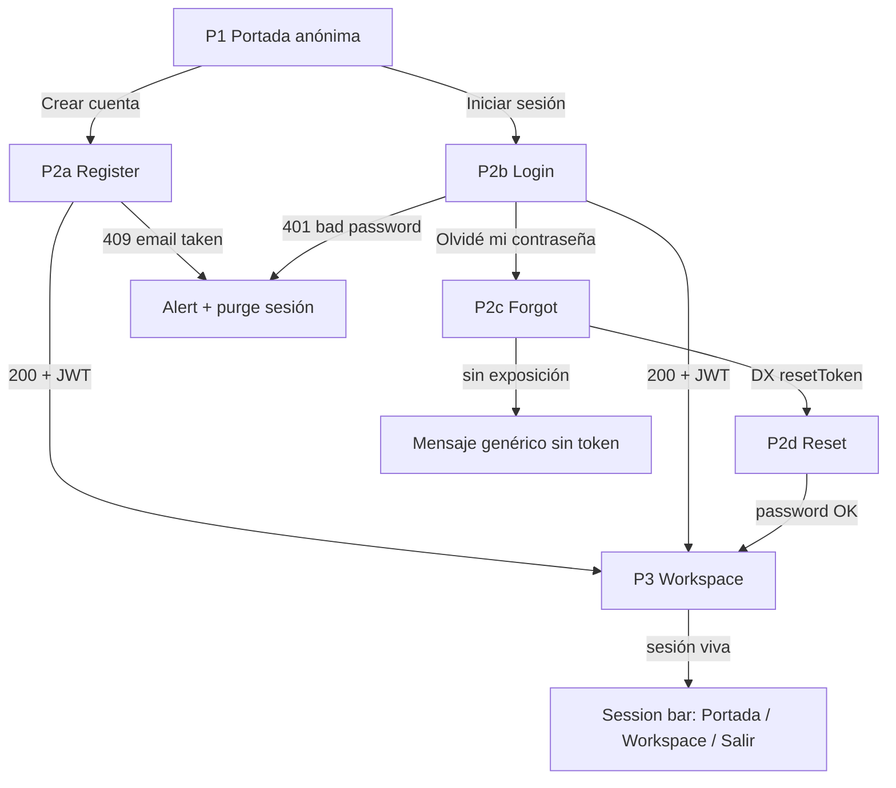
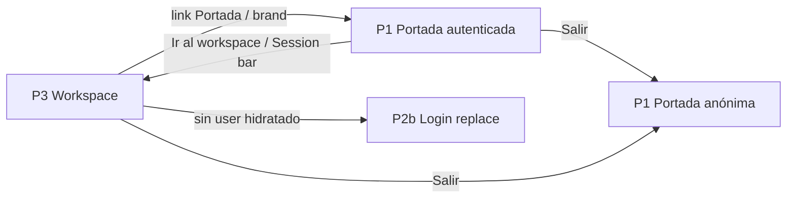
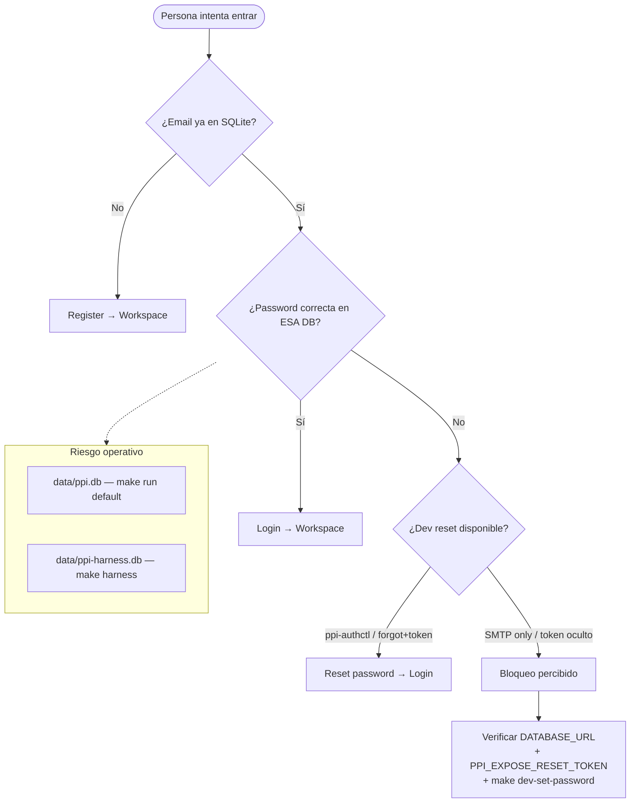
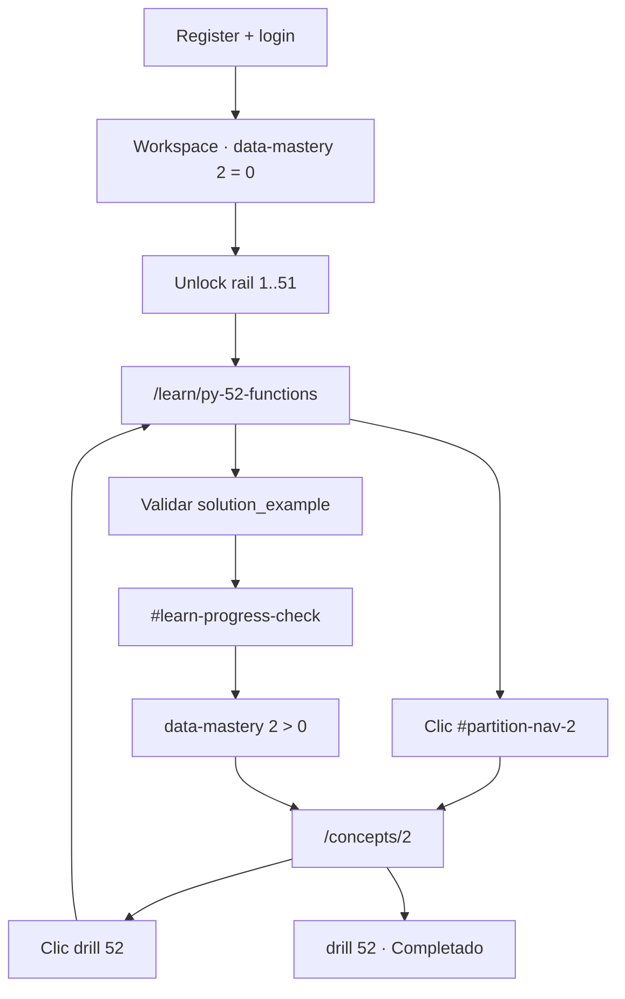

# Journeys de prueba — Auth + Hub (Leptos CSR)

Documento operativo del **ADR 003**. Describe las páginas del shell Leptos, los
caminos felices/fallidos y qué suite Playwright los vigila.

## Mapa de páginas

| # | Ruta | Rol | Señales de “está vivo” |
|---|---|---|---|
| P1 | `/` | Portada | título `IngenierIA`; CTAs register/login **o** `Ir al workspace` si hay sesión |
| P2a | `/register` | Alta | `#register-email`, botón `Crear cuenta` |
| P2b | `/login` | Entrada | `#login-email`, botón `Entrar`, link forgot |
| P2c | `/forgot-password` | Recovery DX | `#forgot-email`; en dev navega con `resetToken` |
| P2d | `/reset-password` | Nueva clave | `#reset-password` (+ token en query/`#reset-token`) |
| P3 | `/workspace` | Hub operativo | `Workspace`, `Nivel actual`, nav `Portada` |

## Journey A — Auth (identidad → hub)



## Journey B — Hub (sesión sin expulsión)



## Opciones / fallos que el harness debe contemplar



## Matriz página ↔ test

| Journey | Spec Playwright | Estado |
|---|---|---|
| Auth P1→P2b→P3 | `auth.login.spec.ts` | Activo |
| Auth recovery P2b→P2c→P2d→P3 | `auth.reset.spec.ts` | Activo |
| Auth errores | `auth.validation.spec.ts` | Activo |
| Hub P3↔P1 + orphan JWT | `session.navigation.spec.ts` | Activo |
| Auth+Hub transversal (páginas 1→3 oiladas) | `journey.auth-hub.spec.ts` | Activo |
| Compás conceptual P2 (Wave A) | `journey.concepts.spec.ts` | Activo |
| Hub conceptual + analytics D.3 | `concepts.partitions.spec.ts` | Activo |

## Journey C — Compás conceptual (partición 2)



## Cómo ejecutar

```bash
# Journey autenticación + hub (stack efímero)
make harness-journeys

# Suite E2E completa del harness
make harness-e2e

# Suite integral (unit + e2e)
make harness
```

Reset local de una cuenta humana (solo desarrollo):

```bash
make dev-set-password EMAIL=vos@example.com PASSWORD=secreto12
# Si estabas en harness:
make dev-set-password EMAIL=vos@example.com PASSWORD=secreto12 DB=sqlite://./data/ppi-harness.db
```
